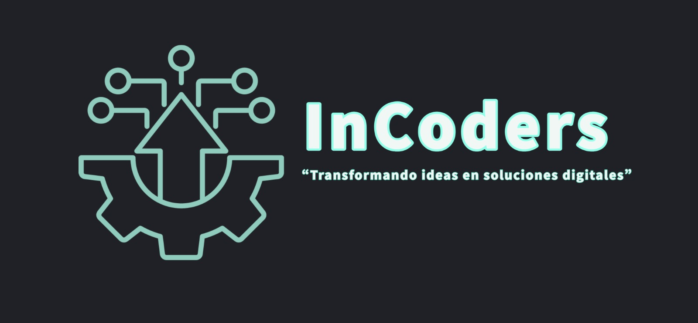

<!-- Improved compatibility of back to top link: See: https://github.com/othneildrew/Best-README-Template/pull/73 -->
<a name="readme-top"></a>
<!--
*** Thanks for checking out the Best-README-Template. If you have a suggestion
*** that would make this better, please fork the repo and create a pull request
*** or simply open an issue with the tag "enhancement".
*** Don't forget to give the project a star!
*** Thanks again! Now go create something AMAZING! :D
-->


<!-- PROJECT SHIELDS -->
<!--
*** I'm using markdown "reference style" links for readability.
*** Reference links are enclosed in brackets [ ] instead of parentheses ( ).
*** See the bottom of this document for the declaration of the reference variables
*** for contributors-url, forks-url, etc. This is an optional, concise syntax you may use.
*** https://www.markdownguide.org/basic-syntax/#reference-style-links
-->
[![Contributors][contributors-shield]][contributors-url]
[![Forks][forks-shield]][forks-url]
[![Stargazers][stars-shield]][stars-url]
[![Issues][issues-shield]][issues-url]
<!--[![MIT License][license-shield]][license-url]-->


<!-- PROJECT LOGO -->
<br />
<div align="center">
  <a href="https://github.com/JafedCalvo/InCoders">
    
  </a>

<h3 align="center">Equipo InCoders</h3>

  <p align="center">
    Equipo creado para la matería "Desarrollo de Software Orientado a Servicios
    <br />
    <a href="https://github.com/JafedCalvo/InCoders"><strong>Visitar el repositorio »</strong></a>
    <br />
    <br />
  </p>
</div>


<!-- TABLE OF CONTENTS 
<details>
  <summary>Tabla de Contenido</summary>
  <ol>
    <li>
      <a href="#about-the-project">Sobre el Proyecto</a>
      <ul>
        <li><a href="#built-with">Herramientas de desarrollo</a></li>
      </ul>
    </li>
    <li>
      <a href="#getting-started">Para Comenzar</a>
      <ul>
        <li><a href="#prerequisites">Pre-Requisitos</a></li>
        <li><a href="#installation">Instalación</a></li>
      </ul>
    </li>
    <li><a href="#usage">Usos</a></li>
    <li><a href="#roadmap">Roadmap</a></li>
    <li><a href="#contributing">Contribuciones</a></li>
    <li><a href="#license">Licencia</a></li>
    <li><a href="#contact">Contacto</a></li>
    <li><a href="#acknowledgments">Agradecimientos</a></li>
  </ol>
</details>-->


<!-- ABOUT THE PROJECT -->
## Sobre El Proyecto



InCoders es un equipo formado por cinco estudiantes del Instituto Tecnológico de Oaxaca para la Materia Desarrollo de Software Orientado a Servicios
<p align="right">(<a href="#readme-top">back to top</a>)</p>


### Herramientas de Desarrollo

* HTML
* JavaScript 
* TypeScript 
* Node 
* Express 
* CSS 

<p align="right">(<a href="#readme-top">back to top</a>)</p>


<!-- GETTING STARTED -->
## Para Comenzar

El Proyecto está en espera de instrucciones.

### Pre-Requisitos

El framework del proyecto está pendiente de elección
* 
  ```sh
  
  ```

### Instalación

La instalación del proyecto está pendiente

1. 
    ```sh
   
   ```
2. 
   ```sh
   
   ```
3. 
   ```sh
   
   ```
4. 
   ```js
   
   ```

<p align="right">(<a href="#readme-top">back to top</a>)</p>


<!-- USAGE EXAMPLES -->
## Usos

Al tratarse de la matería DSOS, el objetivo es la creación de un software que brinde un servicio a las personas, el proyecto está en espera de instrucciones

_De momento no hay ejemplos disponibles_

<p align="right">(<a href="#readme-top">back to top</a>)</p>


<!-- ROADMAP -->
## Roadmap
Las caracteristicas están por definirse 
- [ ] 
- [ ] 
- [ ] 
    - [ ] 


<p align="right">(<a href="#readme-top">back to top</a>)</p>


<!-- CONTRIBUTING 
## Contribuciones

Las indicaciones para poder contribuir con el proyecto se añadirán posteriormente.
<!--
If you have a suggestion that would make this better, please fork the repo and create a pull request. You can also simply open an issue with the tag "enhancement".
Don't forget to give the project a star! Thanks again!

1. Fork the Project
2. Create your Feature Branch (`git checkout -b feature/AmazingFeature`)
3. Commit your Changes (`git commit -m 'Add some AmazingFeature'`)
4. Push to the Branch (`git push origin feature/AmazingFeature`)
5. Open a Pull Request

<p align="right">(<a href="#readme-top">back to top</a>)</p> -->


<!-- LICENSE -->
## Licencia

Distributed under the MIT License. See `LICENSE.txt` for more information.

<p align="right">(<a href="#readme-top">back to top</a>)</p>


<!-- CONTACT -->
## Contacto

InCoders - [@in_coders](https://twitter.com/in_codershttps://twitter.com/twitter_handle) - incoders.tec.oax@gmail.com

Link del Proyecto: [https://github.com/JafedCalvo/InCoders](https://github.com/JafedCalvo/InCoders)

<p align="right">(<a href="#readme-top">back to top</a>)</p>


<!-- ACKNOWLEDGMENTS -->
## Agradecimientos

* [Calvo Torres Jafed](https://github.com/JafedCalvo)
* [Salazar Vasquez Viviana Isabel](https://github.com/chocovivis)
* [Marquez Lopez Rodrigo](https://github.com/RodrigoMarquezLopez)
* [Perez Ruiz Christian](https://github.com/Christian-PR)
* [Torres Cruz Naim](https://github.com/Naim-Torres)


<p align="right">(<a href="#readme-top">back to top</a>)</p>


<!-- MARKDOWN LINKS & IMAGES -->
<!-- https://www.markdownguide.org/basic-syntax/#reference-style-links -->
[contributors-shield]: https://img.shields.io/github/contributors/github_username/repo_name.svg?style=for-the-badge
[contributors-url]: https://github.com/JafedCalvo/InCoders/graphs/contributors
[forks-shield]: https://img.shields.io/github/forks/github_username/repo_name.svg?style=for-the-badge
[forks-url]: https://github.com/JafedCalvo/InCoders/forks
[stars-shield]: https://img.shields.io/github/stars/github_username/repo_name.svg?style=for-the-badge
[stars-url]: https://github.com/JafedCalvo/InCoders/stargazers
[issues-shield]: https://img.shields.io/github/issues/github_username/repo_name.svg?style=for-the-badge
[issues-url]: https://github.com/JafedCalvo/InCoders/issues
[license-shield]: https://img.shields.io/github/license/github_username/repo_name.svg?style=for-the-badge
[license-url]: https://github.com/github_username/repo_name/blob/master/LICENSE.txt
[linkedin-shield]: https://img.shields.io/badge/-LinkedIn-black.svg?style=for-the-badge&logo=linkedin&colorB=555
[linkedin-url]: https://linkedin.com/in/linkedin_username
[product-screenshot]: images/screenshot.png
[Next.js]: https://img.shields.io/badge/next.js-000000?style=for-the-badge&logo=nextdotjs&logoColor=white
[Next-url]: https://nextjs.org/
[React.js]: https://img.shields.io/badge/React-20232A?style=for-the-badge&logo=react&logoColor=61DAFB
[React-url]: https://reactjs.org/
[Vue.js]: https://img.shields.io/badge/Vue.js-35495E?style=for-the-badge&logo=vuedotjs&logoColor=4FC08D
[Vue-url]: https://vuejs.org/
[Angular.io]: https://img.shields.io/badge/Angular-DD0031?style=for-the-badge&logo=angular&logoColor=white
[Angular-url]: https://angular.io/
[Svelte.dev]: https://img.shields.io/badge/Svelte-4A4A55?style=for-the-badge&logo=svelte&logoColor=FF3E00
[Svelte-url]: https://svelte.dev/
[Laravel.com]: https://img.shields.io/badge/Laravel-FF2D20?style=for-the-badge&logo=laravel&logoColor=white
[Laravel-url]: https://laravel.com
[Bootstrap.com]: https://img.shields.io/badge/Bootstrap-563D7C?style=for-the-badge&logo=bootstrap&logoColor=white
[Bootstrap-url]: https://getbootstrap.com
[JQuery.com]: https://img.shields.io/badge/jQuery-0769AD?style=for-the-badge&logo=jquery&logoColor=white
[JQuery-url]: https://jquery.com 
 